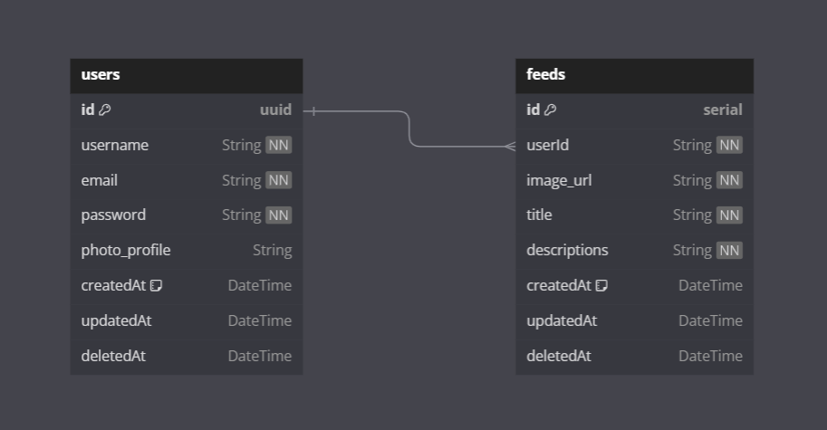

## Project Setup

Clone the project from GitHub repository:

      git clone https://github.com/fajarutamaa/backend-challenge-6.git

Change Directory:

      cd backend-challenge-6

Install all package dependencies:

      npm install

Compile and hot-reload for development:

      npm run dev

## Entity-Relationship Diagram (ERD)

This repository includes the Entity-Relationship Diagram (ERD) illustrating the relationships and structure of our project's database. Below is an example of the ERD for a visual representation of the database schema.

## License

For more information, see the [LICENSE](https://github.com/fajarutamaa/backend-challenge-6/blob/main/LICENSE)